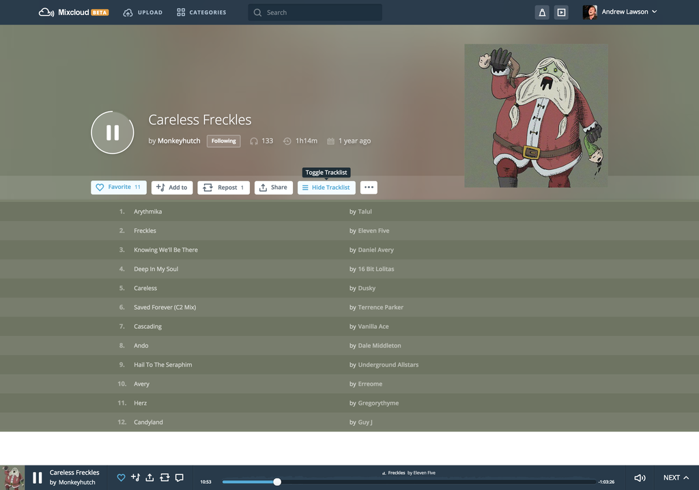

# Mixcloud Tracklist browser extension

This is an *unofficial* Mixcloud browser extension. It displays the tracklist
the same way it did before they changed their [licensing][mc-support].

> As a non-interactive streaming service, our licenses don't allow for
> tracklists to be made visible in advance. However as you listen through a
> show or DJ mix set, the track names will be revealed.
>
> Last Updated: Jul 28, 2015 05:20PM IST

The extension has been built with [Mozilla's WebExtensions API][moz-webext] so
it should be compatible with Mozilla Firefox, Google Chrome, and any other
browser that supports the WebExtension APIs.

## Install
 - [Chrome Web Store][chrome-install]
 - [Firefox Add-ons][firefox-install]

## Thanks
 - [Perry Harlock](https://github.com/perryharlock) for helping me with the the HTML template.

## License
The content of this library is released under the **MIT License** by
**Andrew Lawson**.  You can find a copy of this license in
[`LICENSE`](LICENSE) or at http://opensource.org/licenses/mit.

[chrome-install]: https://chrome.google.com/webstore/detail/mixcloud-tracklist/lkoingeajallinlnijfpmmddoeoficef
[firefox-install]: https://addons.mozilla.org/en-US/firefox/addon/mixcloud-tracklist
[mc-support]: http://support.mixcloud.com/customer/portal/articles/1595557
[moz-webext]: https://wiki.mozilla.org/WebExtensions
